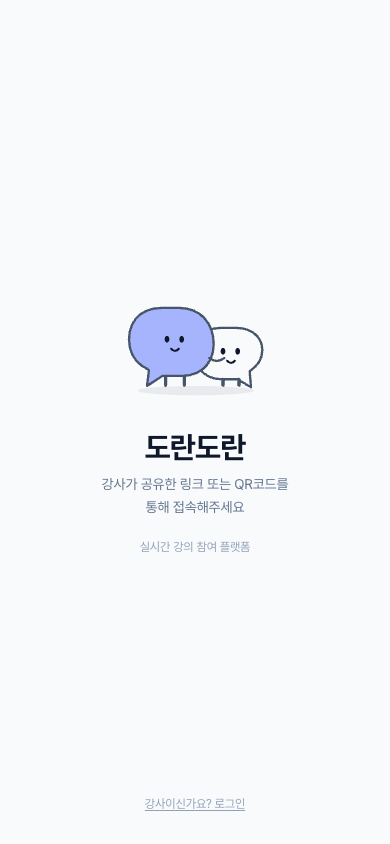
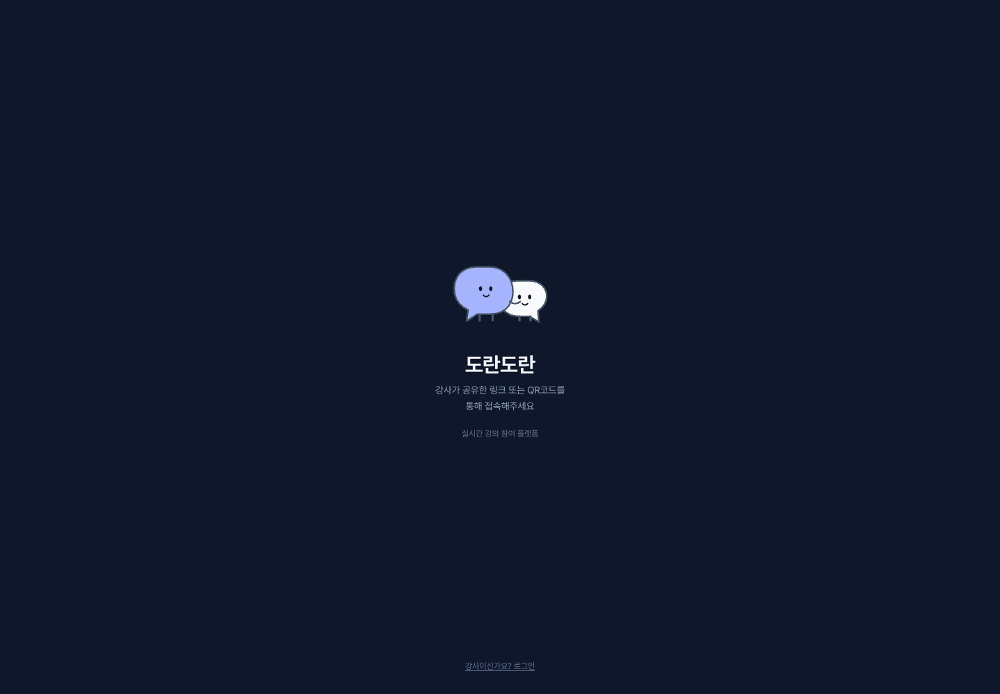
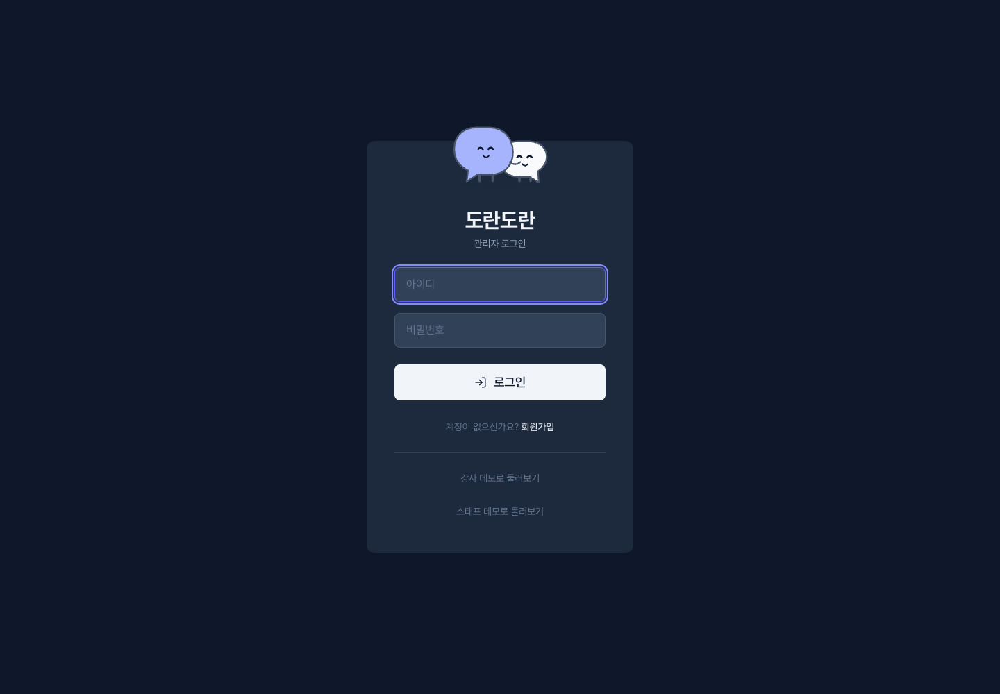

# 도란도란 · DoranDoran

> 가볍게 참여를 던지고 바로 반응하는, 실시간 강의 참여 플랫폼

강사가 수업 중 질문을 출제하면 학생들이 모바일·노트북으로 즉시 응답합니다. 객관식부터 워드클라우드, 퀴즈, AI 심사 과제까지 — 수업을 재미있게 만드는 10+ 참여 도구를 한 곳에.

**Live (배포자 데모)**: https://jinan-6c884.web.app — fork 사용자는 본인 Firebase 프로젝트로 별도 배포

---

## ✨ 핵심 가치

- **1초 안에 이해되는 UX** — 학생이 화면 보자마자 뭘 해야 하는지 안다
- **실시간 반응성** — Firebase RTDB로 모든 변화가 즉시 동기화
- **한국 교실 맞춤** — Pretendard 폰트, 한국어 UI, 강의 흐름에 최적화
- **Anti-AI 디자인** — slate 모노크로매틱 + 신중한 인디고 액센트 (자세한 건 [DESIGN_SYSTEM.md](./DESIGN_SYSTEM.md))
- **AI 도구 내장** — 질문 생성, 응답 요약, 과제 예심/본심까지 Gemini 기반

---

## 🎯 주요 기능

### 📱 학생 (Student)

| 기능 | 설명 |
|---|---|
| **QR 접속** | 링크/QR로 즉시 참여, 닉네임만 입력 |
| **투표·응답 10종** | 객관식, O/X, 워드클라우드, Q&A, 퀴즈, 척도, 토론, 순위, 빈칸채우기, 체크 |
| **타이머** | 질문별 원형 링 카운트다운, 5초 이하 펄스 |
| **리액션** | 👍🔥❤️😂👏 하단바 (lucide 아이콘, 3초 쿨다운) |
| **손들기·긴급 질문** | 익명으로 강사에게 도움 요청 |
| **공개 Q&A** | 질문 올리기 + 추천 기능 |
| **실시간 채팅** | 공개 채팅 + 스태프 1:1 DM |
| **리더보드·업적** | 퀴즈 점수, 연속 정답, 개인 리포트 |
| **다크모드** | Sun/Moon 토글, localStorage 저장 |

### 👨‍🏫 강사 (Instructor)

| 기능 | 설명 |
|---|---|
| **클래스 대시보드** | 강의별 그룹, 세션 생성/복제, 참여율 차트 |
| **질문 관리** | 추가/수정/삭제/드래그 정렬, 보관함 재사용 |
| **키보드 단축키** | ← → (이동), Space (다음), R (정답), L (리더보드), Esc (대기) |
| **게임 모드** | 추첨, 즉석복권, 발표자 뽑기, 쉬는 시간 타이머, 접속 현황 등 14종 |
| **발표 모드** | 전체화면(Fullscreen API) + 화면 꺼짐 방지(Wake Lock), 이미지·웹페이지 슬라이드 |
| **추첨 전용 모드** | 참여자 입장 없이 명단만 넣어 추첨. 엑셀 붙여넣기로 명단 등록 |
| **수업 기록** | 참여율·정답률 통계, 어려웠던 질문 분석, CSV 내보내기 |
| **스태프 관리** | 스태프 계정 초대, 역할 분담 |
| **세션 기록** | 질문별 응답 히스토리, 학생 리포트 |

### 🖥️ 프레젠터 (Projector)

- `/live?s={sessionId}` — 프로젝터·전자칠판용 대형 화면
- 뒷자리에서도 보이는 큰 글자, 높은 대비
- 실시간 막대 상승, 워드클라우드 형성, 리액션 버블
- **보기 전용.** 추첨은 강사 화면에서만 조작하고 전자칠판은 그 진행을 그대로 비춘다
  (두 화면이 각자 돌리면 관객이 보는 결과와 강사가 부르는 결과가 갈리기 때문)

### 🤖 AI 도구 (Gemini 기반)

| 기능 | 사용자 | 설명 |
|---|---|---|
| **AI 질문 생성** | 강사 | 주제 입력 → 3~6개 질문(객관식/OX/워드클라우드/척도) 즉시 생성 |
| **실시간 응답 요약** | 강사 | 워드클라우드·Q&A 응답 5개 이상 → 테마 분류 + 인사이트 |
| **제출 전 AI 예심** | 학생 | 과제 제출 전 1명 AI 코치의 형성 피드백 (강점·개선점·퀵윈) |
| **7명 AI 심사위원** | 강사 | 사후 과제를 7인 패널이 다각도 평가 + 자동 시상 |

### 📝 사후 과제 (Assignment)

- 강사: 과제 등록 → 학생 제출 링크 공유 → 마감 후 AI 심사 → 시상식
- 학생: HTML 파일(또는 ZIP 통째로) 업로드 + PRD + 설명 → 이름·PIN으로 결과 조회
- AI 심사위원 7인: 김기획(PM), 박사용(사용자), 이디자(디자이너), 최실용(팀장), 정창의(대표), 한완성(QA), 강소통(교육자)
- 자동 시상: 대상/최우수/우수 + 기획상/창의상/디자인상/실용상

---

## 📸 Screenshots

| 학생 (모바일) | 학생 (데스크톱) |
|---|---|
|  |  |

| 강사 로그인 |
|---|
|  |

> 🚧 본격 기능 화면(투표·퀴즈·워드클라우드·AI 7판사 심사·리더보드 등)은 추가 예정. 본인 인스턴스에서 캡쳐 후 `docs/screenshots/`에 추가하면 PR 환영.

---

## 🛠️ Tech Stack

```
Frontend    React 19 + Vite 7
Styling     Tailwind CSS v4 + Framer Motion
Icons       lucide-react (이모지 금지)
Fonts       Pretendard (한국어) + Inter (숫자/영문)
Backend     Firebase Realtime Database + Auth + Storage + Hosting
AI          Gemini 2.5 flash-lite (@google/generative-ai)
Drag&Drop   @dnd-kit
ZIP         JSZip (과제 압축 파일 지원)
Animation   lottie-react + Framer Motion
```

---

## 📂 프로젝트 구조

Bulletproof React 패턴 — 기능별 수직 분할:

```
src/
├── app/routes/          # 얇은 페이지 컴포넌트 (조립만)
│   ├── admin/           # /admin — 강사 대시보드
│   ├── live/            # /live  — 프레젠터 화면
│   ├── submit/          # /submit — 과제 제출
│   └── report/          # /report — 학생 리포트
├── components/ui/       # 공통 UI 프리미티브 (비즈니스 로직 금지)
├── features/            # 도메인별 기능 17개 (api/ + components/)
│   ├── session/         # useSession, ConnectionBanner
│   ├── participants/    # useParticipants, ParticipantList
│   ├── voting/          # 9 voter (Choice/OX/Quiz/Wordcloud/Scale/Debate/Ranking/FillBlank/Check)
│   ├── questions/       # AIQuestionGenerator, useUrgentQuestions
│   ├── class-questions/ # ClassQAPanel, ClassQABoard (학생 Q&A)
│   ├── hand-raise/      # useHandRaises, HandRaiseList
│   ├── visualization/   # BarChart, WordCloud, AISummaryBanner, VizRenderer
│   ├── games/           # Lottery, BreakTimer, RandomPicker, JoinShow
│   ├── timer/           # useTimer (서버 시간 동기화)
│   ├── reactions/       # ReactionBar, ReactionOverlay, ChatBubbleOverlay
│   ├── quiz/            # useScores, Leaderboard, useSpeedQuiz
│   ├── chat/            # 공개 채팅 (강사↔학생)
│   ├── dm/              # DMBubble, StaffDMAlert (스태프-학생 1:1)
│   ├── course/          # useCourses (강의 그룹)
│   ├── ai-judge/        # 7판사 LIVE 심사
│   ├── assignments/     # 사후 과제 제출/심사/시상
│   └── report/          # ClassInsightCard, LearningReportCard
├── hooks/               # 크로스피처 훅
├── lib/                 # firebase.js, design-tokens.js
└── styles/              # Tailwind + globals
```

### 아키텍처 규칙

- **Import 방향**: `lib/ → components/ → features/ → app/routes/` (단방향)
- **Feature 격리**: 피처가 다른 피처를 직접 import하지 않음
- **Barrel 금지**: `index.js` 재수출 없이 직접 경로 import
- **Path alias**: `@/` = `src/`

---

## 🚀 시작하기

### 요구사항

- Node.js 22+ (`.env` 자동 로드를 위해 `--env-file` 플래그 사용)
- npm 10+
- Firebase 프로젝트 (RTDB + Hosting)
- Gemini API 키 (AI 기능용)

### 1) 설치

```bash
git clone YOUR_REPOSITORY_URL dorandoran
cd dorandoran
npm install
```

### 2) Firebase 프로젝트 준비

1. [Firebase 콘솔](https://console.firebase.google.com)에서 프로젝트 생성
2. **Realtime Database** 활성화 (asia-southeast1 권장)
3. **Storage** 활성화 (과제 스크린샷 업로드용)
4. **Hosting** 활성화 (`firebase init hosting`)
5. 프로젝트 설정 → 일반 → 내 앱 → Web 앱 SDK 구성에서 config 값 복사

### 3) 환경 변수 (`.env`)

`.env.example`을 복사해서 본인 값으로 채우세요:

```bash
cp .env.example .env
```

채워야 할 항목:
- `VITE_GEMINI_API_KEY` — [Google AI Studio](https://aistudio.google.com/app/apikey)에서 발급
- `VITE_FIREBASE_*` — 위 2단계에서 복사한 값들
- `VITE_COURSE_CONTEXT` — (선택) 본인 강의 맥락. 7판사 AI 심사가 이 텍스트를 참고해 강의에 맞는 평가를 합니다. 비워두면 일반화된 기본 prompt 사용. 본인 강의에 더 깊이 맞춰진 prompt가 필요하면 `src/features/assignments/api/prompts.js`를 직접 수정

> Vite 특성상 `VITE_*`는 빌드 타임에 dist 번들로 인라인됩니다. 프로덕션 배포 시 **Google AI Studio 콘솔에서 HTTP referrer 제한**(본인 도메인만 허용)을 걸어 quota 보호하세요. Firebase Web SDK config는 정책상 secret 아니지만(rules로 보호), 본인 프로젝트 격리를 위해 환경 변수로 분리.

### 4) DB rules 배포

```bash
firebase deploy --only database --project YOUR_PROJECT_ID
```

### 5) 첫 강사 계정 시드 (선택)

`staff-accounts.example.txt` 참고. 실제 운영 계정은 `staff-accounts.txt` (gitignored) 파일로 본인 환경에서 관리하세요. `/admin` 라우트의 회원가입 폼으로 직접 생성도 가능합니다 (마스터 계정 승인 필요).

### 6) 본인 도메인으로 갈 때

`index.html`의 `og:url`, `og:image`, `twitter:image`는 데모 Firebase Hosting 주소를 사용합니다. 본인 도메인으로 운영하면 해당 URL을 변경하고, 별도 출처에서 Gemini 프록시를 호출할 경우 Functions의 `APP_ALLOWED_ORIGINS` 환경 변수에 허용할 출처를 쉼표로 구분해 설정하세요.

브랜드 표기는 **도란도란 / DoranDoran**, 패키지와 브라우저 저장 키의 네임스페이스는 `dorandoran`입니다. `public/storage-upgrade.js`가 앱 전용 저장 필드를 식별해 이전 참가자 정보·메모·로그인 데이터를 새 키로 옮깁니다. 이미 있는 새 값은 유지하고, 쓰기가 실패하면 원본을 보존합니다.

### 로컬 개발

```bash
npm run dev         # Vite 개발 서버
npm run build       # 프로덕션 빌드
npm run preview     # 빌드 결과 미리보기
npm run lint        # ESLint
npm run check       # lint + build
```

### 배포

```bash
npm run build
firebase deploy --only hosting
```

---

## 🛣️ 라우트

| 경로 | 접근 | 설명 |
|---|---|---|
| `/` | 학생 | QR/링크 진입, 세션 참여 |
| `/admin` | 강사·스태프 | 로그인 → 대시보드 → 수업 진행 |
| `/live?s={sessionId}` | 누구나 | 프레젠터 화면 (프로젝터용) |
| `/submit?a={assignmentId}` | 학생 | 과제 제출 및 결과 조회 |
| `/report?s=&p=` | 학생 | 개인 학습 리포트 |

---

## 🔥 Firebase 데이터 구조

```
sessions/{sessionId}
├── info              # 세션 메타 (title, courseName, createdAt)
├── currentQuestion   # 활성 질문 ID
├── currentMode       # poll | quiz | waiting | 특수 모드 14종 (src/lib/modes.js)
├── drawOnly          # 추첨 전용 모드 — 참여자 입장 차단
├── requireEmployeeId # 기업 행사모드 — 입장 시 사번 필수
├── questions/{qId}
│   ├── type          # 17종 (src/lib/question-types.js)
│   ├── title
│   ├── options[]
│   ├── correctAnswer
│   ├── slideImages[] # imageSlide — 최대 10장
│   ├── embedUrl      # webEmbed — http/https만 (DB 규칙에서 검증)
│   ├── activatedAt, revealedAt, awardedAt
│   └── votes/{participantId}  # { nickname, value, timestamp }
├── participants/{pid}
│   ├── nickname, employeeId, online
│   └── source        # 'manual' = 강사가 명단으로 넣은 사람 (입장한 참여자와 구분)
├── scores/{pid}      # 퀴즈 점수, 연속 정답, 업적
├── reactions, handRaises, urgentQuestions, classQuestions
├── chat, staffChat
├── gameState         # 추첨 진행 상태 — 전자칠판이 이걸 보고 따라 그린다
└── gameResult        # 당첨자 발표 — 학생 폰 알림용

assignments/{assignmentId}
├── title, description, status, aiJudging
├── submissions/{subId}
│   ├── name, pin (4자리 숫자)
│   ├── fileContent (HTML/ZIP 추출 텍스트)
│   ├── prdContent, description
│   └── submittedAt, updatedAt
├── results/{subId}
│   ├── judges/{judgeId} # 7명 심사위원별 결과
│   └── summary          # avgScore, selectedCount, passed
└── awards/{awardId}     # 대상/최우수/우수/기획상/...

users/{uid}              # 강사 계정
```

---

## 🎨 디자인 시스템

**원칙**: 화면당 2~3색 이하, 장식 색상 0, 장식 모션 0

```
CTA          bg-slate-900  (dark CTA, indigo 아님)
악센트       indigo         (차트 바, 포커스 링, 진행바 전용)
간격 단위     4px 기본, 카드 p-5, 모달 p-6
모션         spring(300/25), 모두 400ms 이하
터치 타겟    모바일 최소 48px
폰트         Pretendard 400~700, 크기 12~36px
```

자세한 건 [DESIGN_SYSTEM.md](./DESIGN_SYSTEM.md) + [CLAUDE.md](./CLAUDE.md) 참조.

### Anti-AI Aesthetic (중요)

| ❌ AI 기본값 | ✅ DoranDoran |
|---|---|
| `bg-indigo-600` CTA | `bg-slate-900` dark CTA |
| 컬러 원형 아이콘 배경 | bare lucide 아이콘 |
| 5색 배지/선택지 | slate 모노크로매틱 |
| Sparkles/Stars 아이콘 | 말풍선 친구 마스코트 (`DoranDoranMascot`) |

---

## 🤖 AI 기능 상세

### 1. 질문 생성 (`AIQuestionGenerator`)

강사가 수업 중 즉흥 대응할 때 사용. 주제를 입력하면 Gemini가 다양한 타입의 질문을 생성:

- **지원 타입**: choice, ox, wordcloud, scale
- **속도**: ~2초 (gemini-2.5-flash-lite)
- **통합**: 생성 후 기존 `importFromLibrary` 경로로 Firebase에 저장

### 2. 응답 요약 (`AISummaryBanner`)

wordcloud·Q&A 질문에서 응답 5개 이상 쌓이면 활성화. 결과:

```json
{
  "themes": [
    { "label": "개인적 효용", "count": 8, "summary": "..." },
    { "label": "성장/경험", "count": 6, "summary": "..." }
  ],
  "insight": "학생들은 효율성을 가장 큰 동기로 삼고 있으며..."
}
```

- **강사 전용**: `isAdmin` 프롭이 있는 VizRenderer에서만 렌더 (학생 화면 비노출)
- **재분석 유도**: 응답 +3개 이상 새로 들어오면 "새 응답이 있어요" 배지

### 3. 제출 전 AI 예심 (`SubmissionPreview`)

본 심사 전 학생이 자발적으로 받는 형성 피드백. 점수 없이 개선 힌트만:

```json
{
  "overallImpression": "전반적 인상 1~2문장",
  "strengths": ["강점1", "강점2", ...],
  "improvements": ["구체적 개선점1", ...],
  "quickWin": "지금 당장 바꾸면 좋아질 한 가지"
}
```

- **쿨다운**: 2분 (localStorage 기반)
- **활성화 조건**: 코드 파일 업로드 후

### 4. 7명 AI 심사위원 (본 심사)

과제 제출물을 7개 관점에서 병렬 평가 (`Promise.all`). 각 심사위원의 캐릭터·말투·평가 기준이 구분되어 있음:

| 심사위원 | 역할 | 전문 |
|---|---|---|
| 김기획 | PM | 문제 정의·PRD |
| 박사용 | 실사용자 | 직관성·UX |
| 이디자 | 디자이너 | 레이아웃·시각 |
| 최실용 | 팀장 | 실무 활용성 |
| 정창의 | 대표 | 아이디어 독창성 |
| 한완성 | QA | 기능 완성도 |
| 강소통 | 교육자 | AI 협업 품질 |

- **점수 앵커**: 1~3 결함 / 6~7 평균 / 8 인상적 / 9 베스트 / 10 예외적
- **자동 시상**: 대상·최우수·우수 (평균 점수) + 특별상 4개 (판단 심사위원 기준)

---

## 📋 개발 가이드라인

상세 규칙은 [CLAUDE.md](./CLAUDE.md) 참조.

- **JSX only** — TypeScript 없음
- **컴포넌트 200줄 이하** — 넘으면 서브컴포넌트로 분리
- **훅 반환 패턴**: `{ data, loading, error, actions }`
- **Firebase listener**: `useEffect`에서 cleanup 필수
- **Performance**: 무거운 컴포넌트는 `React.memo`, prop 핸들러는 `useCallback`
- **한국어 UI** — 모든 사용자 대면 텍스트는 한국어
- **Firebase 쓰기** — 빠른 연속 쓰기는 debounce

---

## 📚 문서

- [CLAUDE.md](./CLAUDE.md) — 프로젝트 규칙 (AI 코드 어시스턴트용)
- [DESIGN_SYSTEM.md](./DESIGN_SYSTEM.md) — 디자인 토큰·패턴
- [FEATURES.md](./FEATURES.md) — 상세 기능 명세
- [PRD.md](./PRD.md) — 제품 요구사항 문서

---

## 📦 주요 스크립트

| 명령 | 설명 |
|---|---|
| `npm run dev` | Vite 개발 서버 |
| `npm run build` | 프로덕션 빌드 (브로틀리·gzip 압축 포함) |
| `npm run lint` | ESLint |
| `npm run check` | lint + build |
| `npm run preview` | 빌드 결과 로컬 미리보기 |
| `firebase deploy --only hosting` | 배포 |

---

## 🏗️ 배포

Firebase Hosting. Service Worker가 hashed asset만 캐싱하고 `index.html`은 네트워크-온리라 배포 후 즉시 반영됨. CDN 캐시 반영에 몇 분 걸릴 수 있음.

```bash
npm run build
firebase deploy --only hosting --project jinan-6c884
```

---

## ⚠️ 보안 참고

- **Gemini API 키**: `.env`(`VITE_GEMINI_API_KEY`)로만 주입. UI/localStorage 입력 경로는 제거됨. Vite 특성상 빌드 시 클라이언트 번들에 인라인되므로 **Google AI Studio 콘솔에서 referrer 제한 + rate limit**으로 quota 보호. 상용화 시 Cloud Functions 서버 프록시 권장
- **PIN 저장**: 과제 제출 PIN은 평문으로 RTDB에 저장. RTDB Rules에서 schema validation·name/pin immutability 적용됨 (`database.rules.json` `assignments/$assignmentId/submissions`). 진정한 read 차단은 Firebase Auth 도입 + owner-scoping 필요
- **동명이인 보호**: 클라이언트 `isEdit` 플래그 + RTDB Rules에서 name immutability 강제. 신규 제출 시 같은 이름 차단은 클라이언트 사전 검증
- **Auth 부재**: Firebase Auth 미사용 — 강사 로그인은 클라이언트가 `admins` 노드를 직접 읽어 username/passwordHash 비교. `sessions`/`assignments` root listing은 강사 대시보드에 필요해 read 차단 불가. 진정한 권한 분리는 후속 Auth 도입 phase 필요

---

## 🤝 기여

개인 프로젝트지만 외부 기여 환영합니다.

- **이슈 등록 전**: 저장소의 기존 이슈 확인
- **버그 신고**: [bug_report 템플릿](./.github/ISSUE_TEMPLATE/bug_report.md) 사용 — 재현 단계 필수
- **기능 제안**: [feature_request 템플릿](./.github/ISSUE_TEMPLATE/feature_request.md) 사용 — 사용자 시나리오 우선
- **PR 절차**: [CONTRIBUTING.md](./CONTRIBUTING.md) 참고
- **보안 취약점**: 공개 이슈 X — [SECURITY.md](./SECURITY.md) 절차 따라주세요
- **행동 규범**: [CODE_OF_CONDUCT.md](./CODE_OF_CONDUCT.md)

---

## 📄 License

[MIT](./LICENSE) — © 2026 jinan stark ([@wlsdks](https://github.com/wlsdks)).
